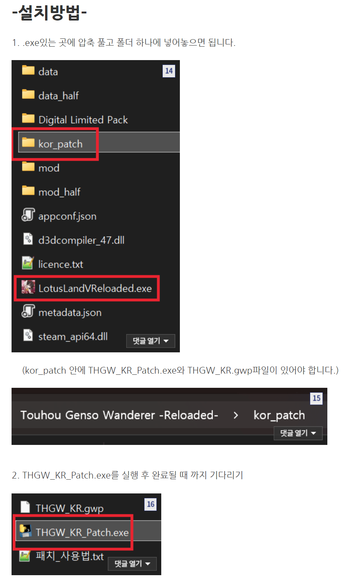
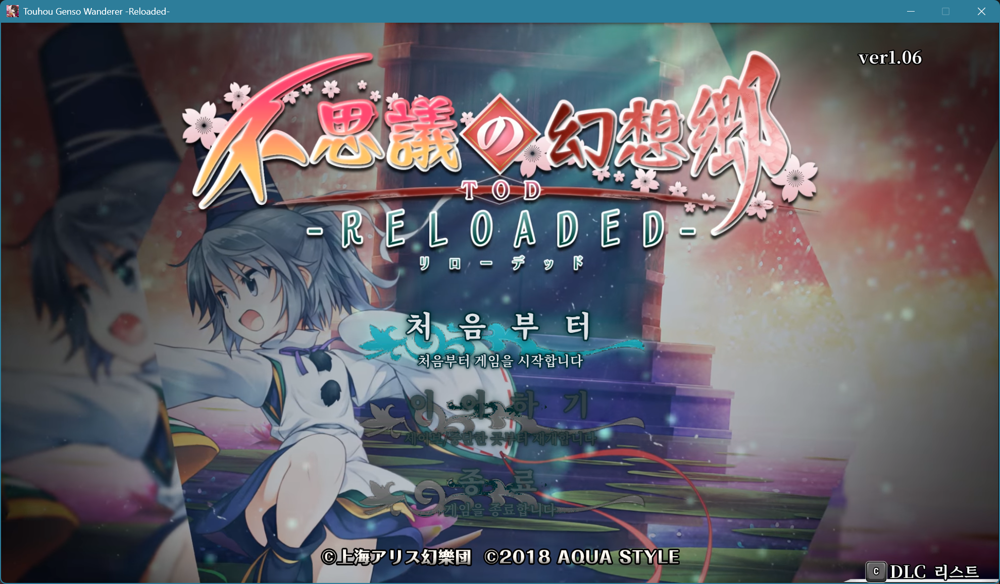
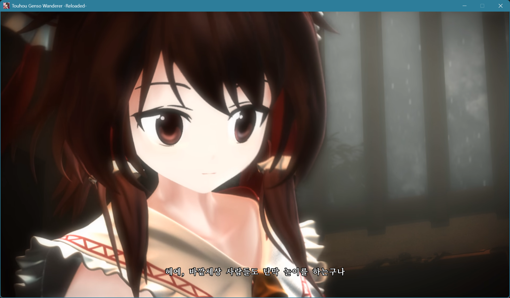
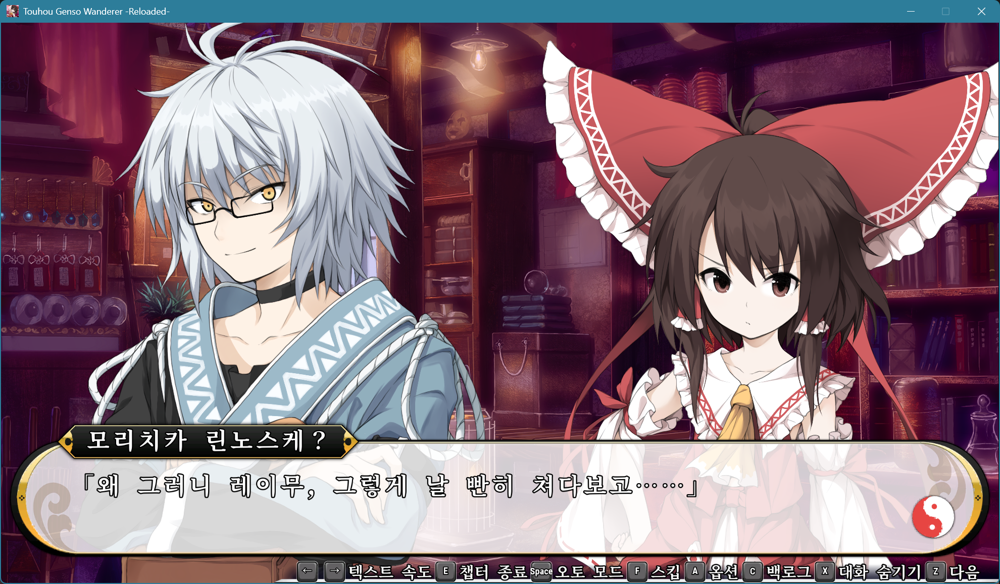
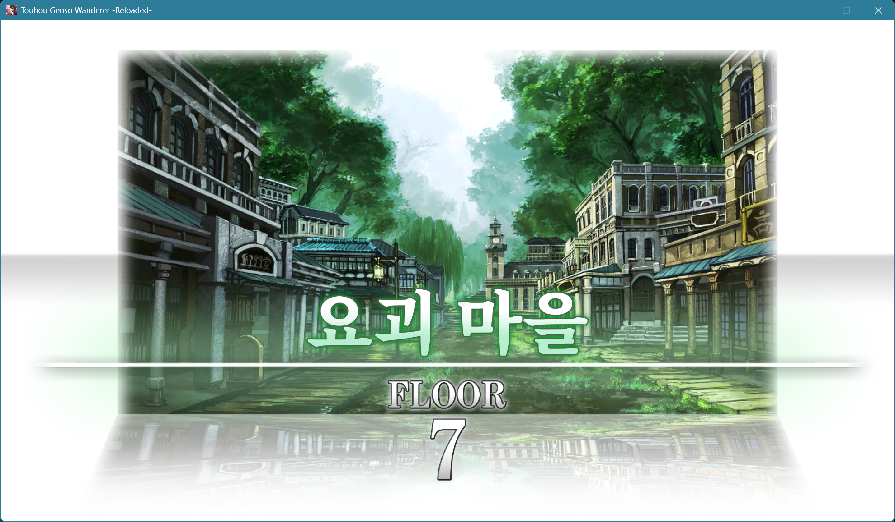
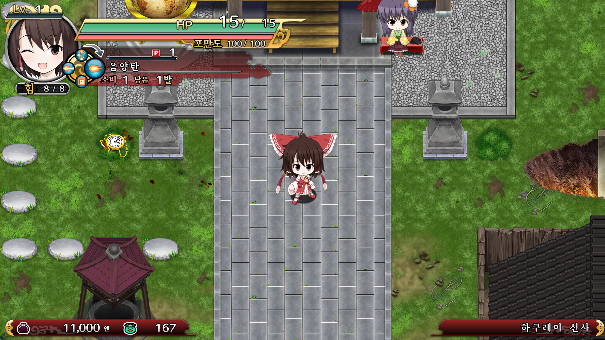
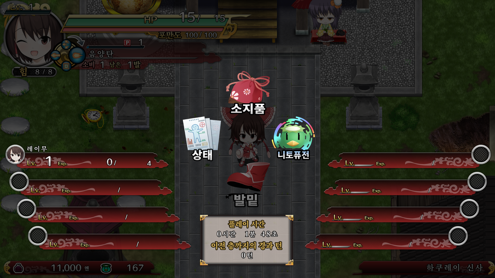
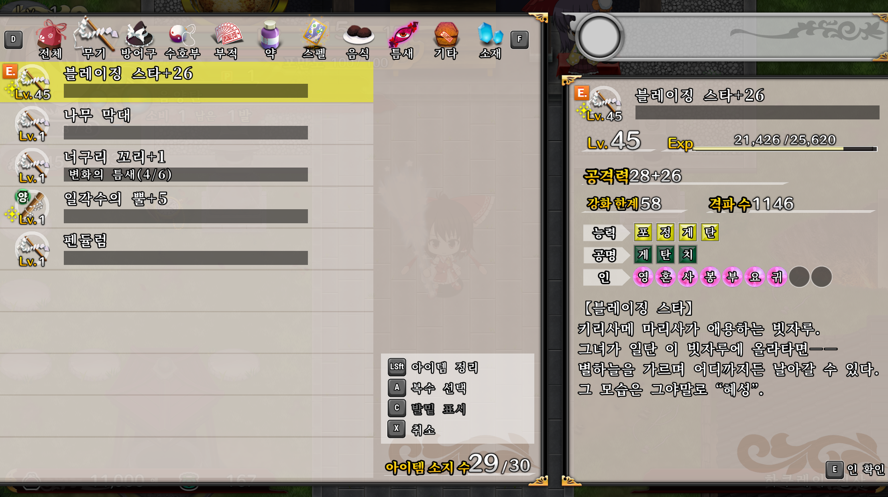
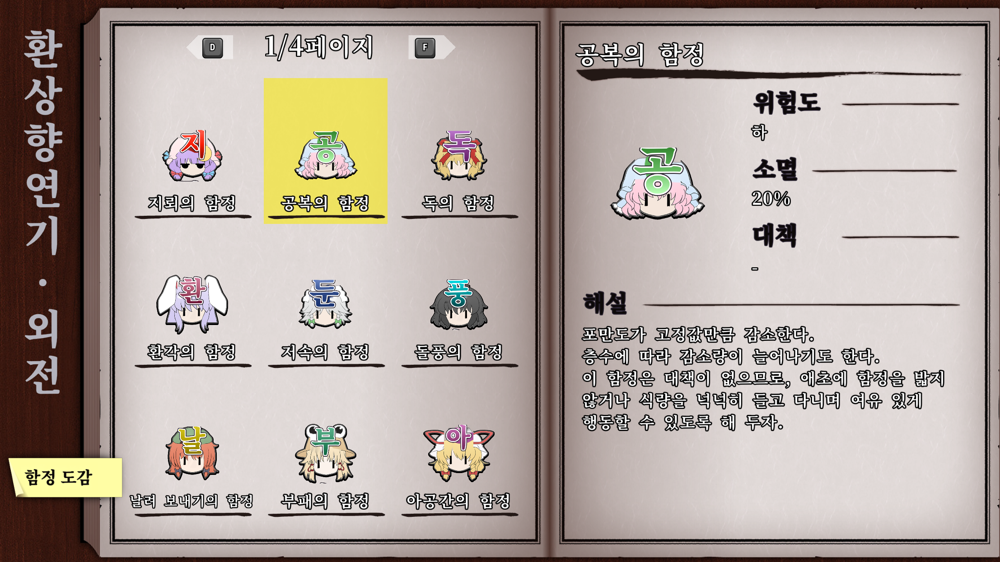
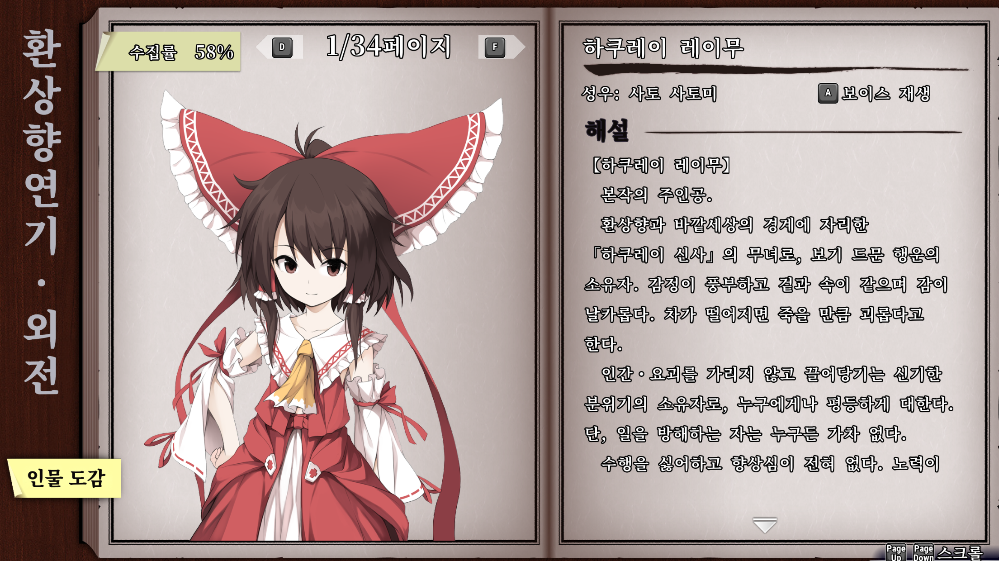

# 동방 프로젝트 이상한 환상향 TOD -RELOADED- 한글 패치

**Touhou Genso Wanderer -Reloaded-** (不思議の幻想郷 TOD -RELOADED-) Steam 판을 위한 비공식 한국어 패치입니다.

대사·아이템·스펠카드 같은 게임 텍스트와 메뉴·HUD의 그림 글자, 각종 연출 이펙트에 그려진 글자까지 한국어로 옮겼습니다.

> [](../../releases/latest)

---

## 설치 방법

1. 스팀 설정에서 언어를 일본어로 설정.
   (언어 설정은 일본어(스팀에서 게임 마우스 오른쪽 클릭 -> 속성 -> 일반 -> 언어를 일본어 선택).)
2. [Releases](../../releases)에서 최신 버전의 압축 파일을 받아 풉니다.
   압축을 풀면 나오는 폴더에 `THGW_KR_Patch.exe`와 `THGW_KR.gwp`가 들어 있습니다.
3. 압축을 푼 폴더를 **게임 폴더 안**에 넣으면 게임 위치를 자동으로 찾습니다.
   예: `...\steamapps\common\Touhou Genso Wanderer -Reloaded-\kor_patch\`
   두 파일은 같은 폴더에 함께 있어야 합니다.
4. `THGW_KR_Patch.exe`를 실행합니다.
   게임 폴더를 찾지 못하면 경로를 물어보니, 게임 폴더 경로를 붙여 넣고 Enter를 누르세요.
5. `한글 패치 적용이 끝났습니다`가 나오면 완료입니다. 몇 분 걸릴 수 있습니다.

- 게임 원본 파일은 `data\default\*.cat.original`처럼 따로 보관됩니다. **지우지 마세요.**
- 새 버전 패치를 다시 적용해도 보관된 원본에서 새로 만들기 때문에 안전합니다.



## 제거 방법

명령 프롬프트에서 다음을 실행합니다.

```
THGW_KR_Patch.exe restore "<게임 폴더>"
```

또는 `data\default`, `data_half\default` 폴더의 `*.cat.original` 파일 이름에서 `.original`을 지워 덮어쓰면 됩니다.

## 문제 해결

**"원본 크기가 다름" 오류가 나며 패치가 멈출 때**

예전에 패치 프로그램을 쓰지 않고 `.cat` 파일을 직접 덮어쓴 경우 `.original` 백업이 없어서 생깁니다.

1. Steam 라이브러리에서 게임 우클릭 → 속성 → 설치된 파일 → **게임 파일 무결성 검사**를 합니다.
2. 남아 있는 `*.cat.original` 파일이 있으면 지웁니다.
3. 패치를 다시 실행합니다.

## 알림

- 이 패치는 팬이 만든 **비공식** 한글 패치이며, 원작자·개발사·유통사와 관련이 없습니다.
- 동방 프로젝트의 저작권은 상하이 앨리스 환악단(上海アリス幻樂団)에 있으며, 게임의 저작권은 각 권리자에게 있습니다.
- 이 저장소와 패치 파일에는 게임 원본 데이터가 포함되어 있지 않습니다. 패치를 쓰려면 정품 게임이 필요합니다.
- 패치 사용으로 생기는 문제에 대해서는 책임지지 않습니다. 적용 전에 세이브 데이터를 백업해 두는 것을 권장합니다.


## 스크린샷








